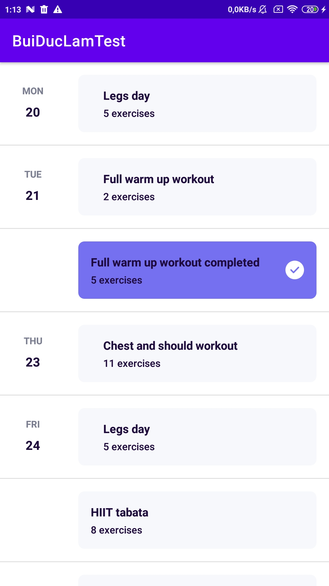

# AndroidTest
A new Calendar project.
## Getting Started
handle 2 solution:
+ mutils list
+ add list into list
## base project:
-   Modern architecture (Clean Architecture, Model-View-ViewModel)
-   ViewModel, LiveData, Lifecycle, Hilt ... with [Android Jetpack](https://developer.android.com/jetpack)
-   Hilt: with [cheat sheet](https://developer.android.com/images/training/dependency-injection/hilt-annotations.pdf)
# Screenshots
|                         |                         |
|        :---:            |          :---:          |
|  |